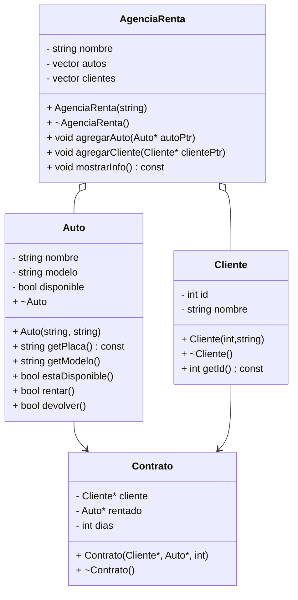

```mermaid
classDiagram
    class Auto {
        - string nombre
        - string modelo
        - bool disponible
        + Auto(string, string)
        + ~Auto
        + string getPlaca() const
        + string getModelo()
        + bool estaDisponible()
        + bool rentar()
        + bool devolver()
    }

    class Cliente {
        - int id
        - string nombre
        + Cliente(int,string)
        + ~Cliente() 
        + int getId() const
    }

    class Contrato {
        - Cliente* cliente
        - Auto* rentado
        - int dias
        + Contrato(Cliente*, Auto*, int)
        + ~Contrato()
    }

    class AgenciaRenta {
        - string nombre
        - vector<Auto*> autos
        - vector<Cliente*> clientes
        + AgenciaRenta(string)
        + ~AgenciaRenta()
        + void agregarAuto(Auto* autoPtr)
        + void agregarCliente(Cliente* clientePtr)
        + void mostrarInfo() const
    }

    AgenciaRenta o-- Auto
    AgenciaRenta o-- Cliente
    Auto --> Contrato
    Cliente --> Contrato
```
